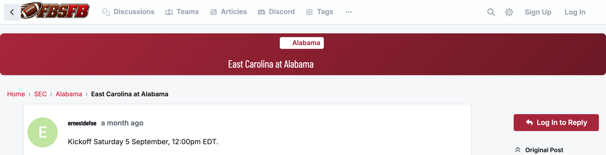
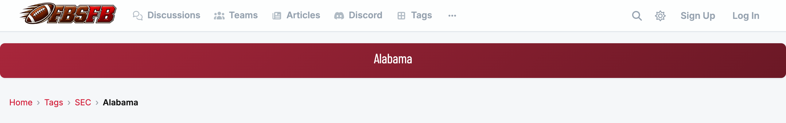
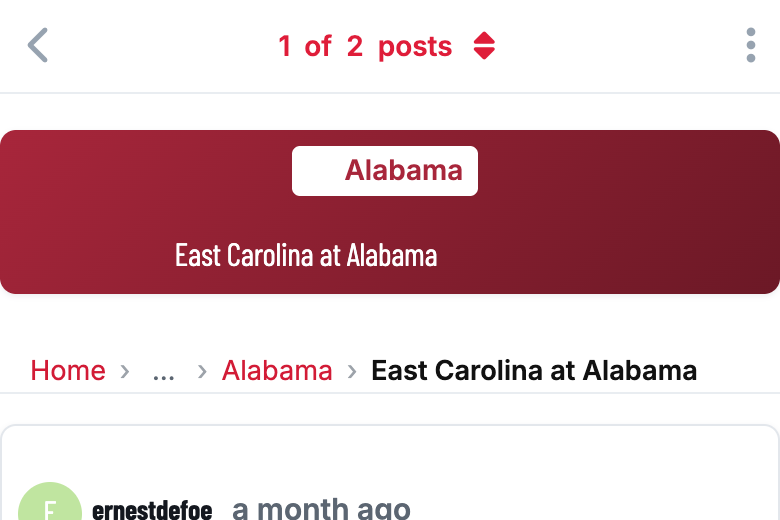
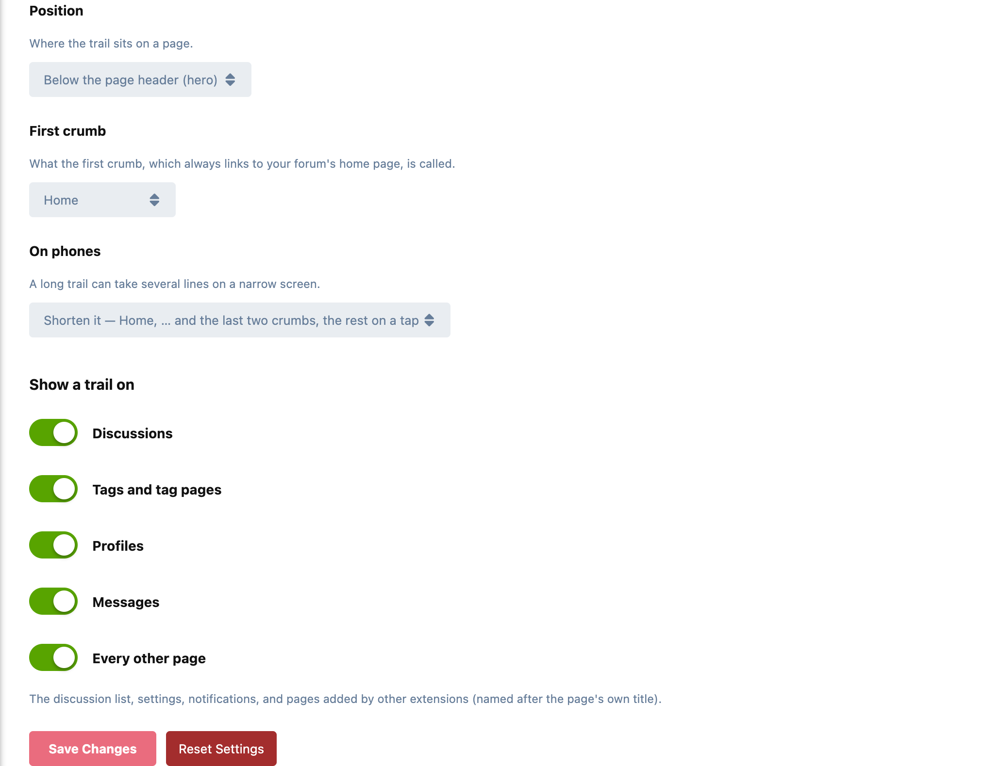

# Waymark

Breadcrumbs for Flarum 2. A single line at the top of every page says where you
are and how you got there, the way traditional forums always have:

`Home › SEC › Alabama › East Carolina at Alabama`

Every crumb but the last is a link, so going back up a level is one click.



## Where it shows

| Page | Trail |
|---|---|
| A tag | Home › Tags › SEC |
| A child tag | Home › Tags › SEC › Alabama |
| A discussion | Home › SEC › Alabama › *the discussion* |
| The tags page | Home › Tags |
| Searching inside a tag | Home › Tags › SEC › Search: “bama” |
| A profile | Home › *name* |
| A profile tab | Home › *name* › Discussions |
| Messages | Home › Messages › *the conversation* |
| Settings, notifications | Home › Settings |
| Any other page | Home › *the page's title*, e.g. Home › Pick'em |

The home page itself has no trail. **Home always links to your forum's home
page, whatever that is.** If your home is the tags page, the "Tags" crumb is
left out, so a tag reads Home › SEC › Alabama.

A discussion follows its **primary** tags: its child tag and that tag's parent.
Secondary tags describe a discussion; they aren't where it lives.





On a phone a long trail shortens to Home › … › Alabama › *the discussion*, and
tapping … shows the rest.

## Settings

Admin → Waymark:

- **Style:** plain links separated by ›, or tabs (below).
- **Position:** below the page header (hero) or above it.
- **First crumb:** "Home", or your forum's title.
- **On phones:** shorten the trail, or hide it.
- **Show a trail on:** discussions, tags, profiles, messages and every other
  page, each switched separately.

It uses your theme's own text and link colours, so there's nothing to style.



### Tabs

Each step on its own slanted tab. The design is
[Tutrix](https://discuss.flarum.org/u/Tutrix)'s, shared in the Waymark thread
on discuss.flarum.org and built in so nobody has to keep the CSS up to date.


It follows your colour scheme, and on a phone it shortens the same way the
plain style does:


## Search engines

Search engines can show a page's breadcrumb in their results instead of its
URL, when the page describes its trail as
[BreadcrumbList](https://schema.org/BreadcrumbList) structured data.

**Without FoF SEO,** Waymark adds that structured data itself, to discussions
and tag pages, matching the visible trail:

```
Home › SEC › Alabama › East Carolina at Alabama
```

A discussion or tag the visitor can't see gets none, so nothing private is
named.

**With [FoF SEO](https://github.com/FriendsOfFlarum/seo),** which already
publishes a breadcrumb for every page, Waymark adds nothing of its own (two
would give search engines two answers). It keeps FoF SEO's in step with the
visible trail instead:

- the first crumb uses the same word ("Home", or your forum's title)
- "Tags" is translated, and left out when the tags page is your home page
- a profile's Discussions tab gets its crumb

## For extension developers

Give your route its own trail. Return the crumbs after Home, the last one being
the page itself, or `null` for no trail:

```js
app.waymark?.register('my-extension.page', () => [
  { label: 'Section', href: app.route('my-extension.section') },
  { label: 'This page' },
]);
```

Pages that use Flarum's `PageStructure` get the trail placed for them. A page
that renders its own layout can draw it itself:

```js
{app.waymark?.render([{ label: 'Articles', href: '/c/articles' }, { label: title }])}
```

`render` returns nothing on the home page, so it's safe to call everywhere.
[Page Builder](https://github.com/ernestdefoe/page-builder) does this for its
pages, and swaps its "← Back" link for the trail when Waymark is installed.

## Installation

```bash
composer require ernestdefoe/waymark
php flarum cache:clear
```

Then enable **Waymark** in the admin panel.

## Updating

```bash
composer update ernestdefoe/waymark
php flarum cache:clear
```

## Licence

MIT.
